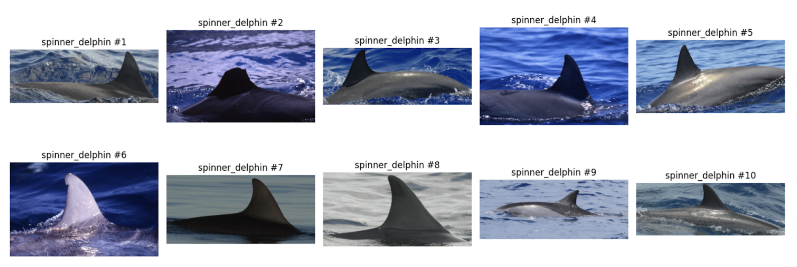

# whales-identification
Библиотека для идентификации морских млекопитающих со снимков аэрофотосъемки

## Цель выполнения проекта:
Разработка библиотеки искусственного интеллекта для автоматического детектирования и идентификации крупных морских млекопитающих по данным аэрофотосъемки.

## Структура репозитория

### Исследования, эксперименты, сравнение
- `research/notebooks/*` - набор исследовательских ipynb ноутбуков с сравнением различных методов идентификации
- `research/notebooks/README.md` - вывод о результатах и границах применимости в результате проведенных сравнений.
- `research/notebooks/02_ViT_train_effiecientnet.ipynb` - обучение модели идентификации с использованием Metric Learning подхода на основе трансформерной архитектуры ViT.
- `research/notebooks/02_ViT_inference_efficientnet.ipynb` - оценка результатов модели с использованием Metric Learning подхода на основе трансформерной архитектуры ViT.
- `research/notebooks/03_efficientnet_experiments.ipynb` - сравнение Metric Learning подходов на основе CNN EfficientnetB0, EfficientnetB3, EfficientnetB5 архитектур.
- `research/notebooks/04_resnet_classification_experiments.ipynb` - сравнение CNN classification подходов на основе CNN Resnet54, Resnet101 архитектур
- `research/notebooks/05_swinT_experiments.ipynb` - оценка результатов модели с использованием Metric Learning подхода на основе трансформерной архитектуры SwinTransformers.
- `research/notebooks/06_benchmark.ipynb` - сравнение всех перспективных моделей на одном наборе данных.
- `research/notebooks/07_onnx_inference_compare.ipynb` - сравнение ускорения за счет использования ONNX фреймворка.

Модели можно скачать по этой ссылке (ввиду ограничения объема на бесплатный git lfs): https://disk.yandex.ru/d/GshqU9o6nNz7ZA

- `research/demo-ui/*` - демо веб-приложение с выбранным наилучшим решением для наглядной оценки качества его работы, с возможностью загрузить изображение для анализа. Более подробная информация в разделе `./demo-ui/README.md`.
- `research/demo-ui-mask/*` - демо веб-приложение иного подхода, позволяющее улучшить качество работы алгоритма, за счет использования бинарной маски с изображением млекопитающего. Более подробная информация в разделе `./demo-ui/README.md`.

### Результаты сравнения

| Критерий                         | CNN (ResNet-54)             | CNN (ResNet-101)             | Metric Learning (EfficientNet-B0)   | Metric Learning (EfficientNet-B5)   | ViT-B/16                     | ViT-L/32                        | Swin-T                          |
|-----------------------------------|-----------------------------|------------------------------|--------------------------------------|--------------------------------------|--------------------------------------|--------------------------------------|--------------------------------------|
| **Точность (Precision)**          | 82%                         | 85%                          | 88%                                  | 91%                                  | 91%                                  | 93%                                  | 90%                                 |
| **Скорость обработки (средняя)**  | ~0.8 секунды                | ~1.2 секунды                 | ~1.0 секунда                         | ~1.8 секунды                         | ~2.0 секунды                         | ~3.5 секунды                         | ~2.2 секунды                         |
| **Масштабируемость**              | Хорошая, линейная сложность | Средняя, увеличенные ресурсы | Высокая, линейная сложность          | Средняя, ресурсоемкая                | Средняя, увеличивается с данными     | Низкая, требует значительных ресурсов | Высокая, линейная сложность         |
| **Универсальность и адаптивность**| Средняя                     | Высокая                      | Высокая, устойчива к изменениям      | Очень высокая, устойчива к изменениям | Очень высокая                        | Очень высокая                        | Высокая                             |
| **Интерфейс и удобство использования** | Простой интерфейс          | Более сложный интерфейс      | Требует настройки эмбеддингов         | Требует более сложной настройки эмбеддингов | Требует оптимизации для пользователей | Требует высокой оптимизации           | Простой интерфейс                   |
| **Интеграция с другими системами** | Легко интегрируется         | Поддерживает интеграцию      | Совместим с базами данных            | Совместим, но требует дополнительных модулей | Требует модулей для интеграции       | Требует модулей и оптимизации         | Легко интегрируется                 |
| **Надежность и стабильность**     | 94% доступности            | 92% доступности              | 95% доступности                      | 93% доступности                      | 93% доступности                      | 90% доступности                      | 94% доступности                     |
| **Чувствительность (Sensitivity)**| 78%                         | 82%                          | 85%                                  | 88%                                  | 89%                                  | 91%                                  | 90%                                  |
| **Специфичность (Specificity)**   | 88%                         | 90%                          | 92%                                  | 94%                                  | 91%                                  | 92%                                  | 91%                                  |
| **Полнота (Recall)**              | 76%                         | 80%                          | 85%                                  | 88%                                  | 89%                                  | 91%                                  | 90%                                  |
| **F1-мера**                       | 0.79                        | 0.82                         | 0.86                                 | 0.89                                 | 0.90                                 | 0.92                                 | 0.91                                 |
| **Требования к датасету**         | ~60,000 тренировочных и ~20,000 тестовых | ~60,000 тренировочных и ~20,000 тестовых | ~60,000 тренировочных и ~20,000 тестовых | ~60,000 тренировочных и ~20,000 тестовых | ~60,000 тренировочных и ~20,000 тестовых | ~60,000 тренировочных и ~20,000 тестовых | ~60,000 тренировочных и ~20,000 тестовых |

- [ ] Завершенный проект открытых библиотек, размещенный в открытом доступе в информационно-телекоммуникационной сети «Интернет» и предоставляемый любым лицам на условиях безвозмездной бессрочной открытой лицензии.

## Описание

Эта библиотека предоставляет инструменты для обучения и тестирования моделей, способных идентифицировать виды китов и дельфинов на основе аэрофотоснимков. Она включает в себя функциональность для работы с изображениями, аугментации данных, настройки моделей и подготовки датасетов.

## Установка

Есть 3 варианта:

1) Для установки библиотеки используйте пакетный менеджер `poetry`:

```bash
git clone https://github.com/0x0000dead/whales-identification
cd whales-identification
docker build . -t whales
docker run -p 8501:8501 whales
```

2) 
```
pip install poetry
poetry install
cd research/demo-ui/
poetry run streamlit run streamlit_app.py --server.port=8501 --server.address=0.0.0.0
```

### Пример датасета



## Перечень Работ, выполняемых в рамках проекта, распределение Работ между членами проектной команды.
Этап 1.
- [ ] (Балцат К.И.) Настройка репозитория для автоматической проверки и одобрения изменений в коде для расширения функциональности. 
- [ ] (Балцат К.И.) Тестирование пилотных прототипов алгоритмов детекции объектов и обработки изображений. 
- [ ] (Балцат К.И.) Исследование и уточнение функциональных требований к решению через проведение интервью с экспертами в области морской биологии.
- [ ] (Балцат К.И., Тарасов А.А.) Разработка прототипов алгоритмов детекции объектов и обработки изображений. 

- [ ] (Тарасов А.А.) Обработка данных: сбор, обогащение и аугментация данных. 
- [ ] (Тарасов А.А.) Разработка алгоритмов машинного обучения для автоматизированной обработки данных (Data Stream). 

- [ ] (Ванданов С.А.) Обучение нейронной сети на начальном этапе с сохранением промежуточных весов. 
- [ ] (Ванданов С.А.) Исследование, сравнение и выбор алгоритмов компьютерного зрения. 
- [ ] (Ванданов С.А.) Прототипирование алгоритмов машинного обучения для идентификации по снимкам млекопитающих. 
- [ ] (Ванданов С.А., Серов А.И.) Разработка общей архитектуры системы нейронных сетей (ML System Design). 

- [ ] (Серов А.И.) Системный анализ ПО: выявление и оптимизация проблемных мест системы нейронных сетей. 
- [ ] (Серов А.И.) Разработка алгоритма многоклассовой классификации объектов по снимкам. 
- [ ] (Серов А.И.) Проведение код-ревью разработанных прототипов. 
- [ ] (Серов А.И.) Тестирование и сравнение архитектур алгоритмов многоклассовой классификации. 