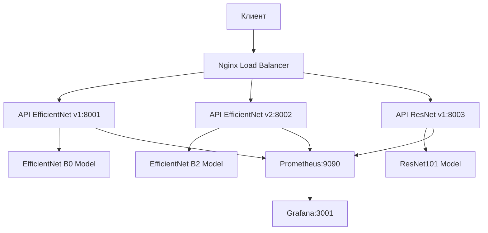

# Whales Identification API

Система идентификации морских млекопитающих с поддержкой множественных моделей машинного обучения и API для инференса.

## 🚀 Фреймворк и Архитектура

### Выбор фреймворка: FastAPI

Для реализации API был выбран **FastAPI** по следующим причинам:

1. **Высокая производительность** - один из самых быстрых Python веб-фреймворков
2. **Автоматическая документация** - OpenAPI/Swagger из коробки
3. **Типизация** - полная поддержка Python type hints
4. **Асинхронность** - нативная поддержка async/await
5. **Валидация данных** - автоматическая валидация через Pydantic
6. **Простота развертывания** - легкая интеграция с Docker и производственными серверами

### Архитектура системы



## 📋 Возможности API

### Основные эндпоинты

- `GET /` - Информация об API
- `GET /models` - Список доступных моделей
- `GET /models/{model_name}/info` - Детальная информация о модели
- `POST /predict` - Предсказание с моделью по умолчанию
- `POST /predict/{model_name}` - Предсказание с указанной моделью
- `POST /compare` - Сравнение предсказаний нескольких моделей
- `GET /health` - Проверка состояния сервиса
- `GET /metrics` - Метрики производительности
- `POST /models/{model_name}/load` - Принудительная загрузка модели

### Поддерживаемые модели

1. **EfficientNet v1** (`efficientnet_v1`)
   - Модель: tf_efficientnet_b0_ns
   - Размер изображения: 448x448
   - Embedding размер: 512
   - Версия: 1.0

2. **EfficientNet v2** (`efficientnet_v2`)
   - Модель: tf_efficientnet_b2_ns
   - Размер изображения: 512x512
   - Embedding размер: 512
   - Версия: 2.0

3. **ResNet v1** (`resnet_v1`)
   - Модель: resnet101
   - Размер изображения: 448x448
   - Embedding размер: 512
   - Версия: 1.0

## 🛠 Установка и запуск

### Предварительные требования

- Docker и Docker Compose
- Python 3.10+ (для локальной разработки)
- Git

### Быстрый старт с Docker Compose

1. **Клонирование репозитория:**
```bash
git clone <repository-url>
cd whales-identification
git checkout homework-api-service
```

2. **Запуск всех сервисов:**
```bash
docker-compose up -d
```

3. **Проверка запуска:**
```bash
# Проверка состояния контейнеров
docker-compose ps

# Проверка логов
docker-compose logs api-efficientnet-v1
```

### Доступ к сервисам

После запуска будут доступны следующие сервисы:

- **API EfficientNet v1**: http://localhost:8001
- **API EfficientNet v2**: http://localhost:8002
- **API ResNet v1**: http://localhost:8003
- **Nginx (Load Balancer)**: http://localhost:8080
- **Frontend**: http://localhost:3000
- **Prometheus**: http://localhost:9090
- **Grafana**: http://localhost:3001 (admin/admin)

### Конфигурация через переменные окружения

Каждый API сервис может быть настроен через переменные окружения:

```bash
# Модель по умолчанию
DEFAULT_MODEL=efficientnet_v1

# Устройство для инференса (cpu/cuda)
DEVICE=cpu

# Уровень логирования
LOG_LEVEL=INFO

# Включение метрик
ENABLE_METRICS=true

# Максимальный размер файла (байты)
MAX_FILE_SIZE=10485760

# Размер батча
BATCH_SIZE=8
```

## 📖 Использование API

### Пример запроса предсказания

```bash
# Предсказание с моделью по умолчанию
curl -X POST "http://localhost:8001/predict" \
     -H "accept: application/json" \
     -H "Content-Type: multipart/form-data" \
     -F "file=@whale_image.jpg"

# Предсказание с конкретной моделью
curl -X POST "http://localhost:8002/predict/efficientnet_v2" \
     -H "accept: application/json" \
     -H "Content-Type: multipart/form-data" \
     -F "file=@whale_image.jpg"
```

### Пример ответа

```json
{
  "model_name": "efficientnet_v1",
  "model_version": "1.0",
  "predictions": [
    {
      "whale_id": "W-00123",
      "confidence": 0.8543,
      "class_index": 123
    },
    {
      "whale_id": "W-00456", 
      "confidence": 0.7621,
      "class_index": 456
    }
  ],
  "embedding": [0.123, 0.456, ...],
  "metrics": {
    "preprocessing_time": 0.045,
    "inference_time": 0.123,
    "total_time": 0.168,
    "model_name": "efficientnet_v1"
  },
  "file_info": {
    "filename": "whale_image.jpg",
    "content_type": "image/jpeg",
    "size": 204800
  }
}
```

### Сравнение моделей

```bash
# Сравнение всех доступных моделей
curl -X POST "http://localhost:8080/compare" \
     -H "accept: application/json" \
     -H "Content-Type: multipart/form-data" \
     -F "file=@whale_image.jpg"

# Сравнение конкретных моделей
curl -X POST "http://localhost:8080/compare?models=efficientnet_v1&models=resnet_v1" \
     -H "accept: application/json" \
     -H "Content-Type: multipart/form-data" \
     -F "file=@whale_image.jpg"
```

## 🧪 Тестирование и Бенчмарки

### Запуск бенчмарка производительности

Скрипт для тестирования производительности и качества всех моделей:

```bash
# Установка зависимостей для бенчмарка
pip install aiohttp pandas matplotlib seaborn

# Запуск бенчмарка
python scripts/benchmark_models.py \
    --images-dir ./data/datasets \
    --max-images 20 \
    --concurrent 3 \
    --output-dir ./benchmark_results
```

### Параметры бенчмарка

- `--images-dir`: Путь к директории с тестовыми изображениями
- `--max-images`: Максимальное количество изображений для тестирования
- `--concurrent`: Количество одновременных запросов
- `--output-dir`: Директория для сохранения результатов

### Результаты бенчмарка

После выполнения создаются:

- `raw_results.csv` - Сырые данные всех запросов
- `analysis.json` - Детальный анализ производительности
- `report.txt` - Текстовый отчет с рекомендациями
- `benchmark_visualization.png` - Графики производительности
- `success_rate.png` - График успешности запросов

## 🔧 Разработка

### Локальный запуск для разработки

```bash
# Создание виртуального окружения
python -m venv venv
source venv/bin/activate  # Linux/Mac
# или
venv\Scripts\activate  # Windows

# Установка зависимостей
pip install -r requirements.txt

# Запуск FastAPI сервера
cd whales_be_service
uvicorn src.whales_be_service.main:app --reload --host 0.0.0.0 --port 8000
```

### Структура проекта

```
whales-identification/
├── whales_be_service/          # FastAPI приложение
│   ├── src/whales_be_service/
│   │   ├── main.py            # Основное приложение
│   │   ├── config.py          # Конфигурация моделей
│   │   ├── models.py          # Модели ML и менеджер
│   │   └── routers.py         # Дополнительные роуты
│   └── Dockerfile
├── scripts/
│   └── benchmark_models.py    # Скрипт бенчмарка
├── docker-compose.yml         # Оркестрация сервисов
├── nginx.conf                 # Конфигурация балансировщика
└── README.md
```

## 📊 Мониторинг и Метрики

### Prometheus метрики

API автоматически собирает метрики:

- Количество запросов по моделям
- Время выполнения запросов
- Количество ошибок
- Процент успешности

### Grafana дашборды

Предустановленные дашборды для мониторинга:

- Производительность API
- Использование моделей  
- Ошибки и доступность
- Сравнение моделей

Доступ: http://localhost:3001 (admin/admin)

## 🚀 Производственное развертывание

### Docker Compose Production

```bash
# Создание production файла
cp docker-compose.yml docker-compose.prod.yml

# Редактирование для production
# - Удаление портов разработки
# - Добавление secrets для паролей
# - Настройка логирования
# - Добавление health checks

# Запуск в production режиме
docker-compose -f docker-compose.prod.yml up -d
```

### Рекомендации для production

1. **Безопасность:**
   - Использование secrets для паролей
   - Настройка HTTPS через reverse proxy
   - Ограничение доступа к внутренним портам

2. **Масштабирование:**
   - Добавление дополнительных реплик API
   - Использование внешней базы данных для метрик
   - Настройка автоматического масштабирования

3. **Мониторинг:**
   - Настройка алертов в Grafana
   - Логирование в внешние системы
   - Health checks для всех сервисов

## 🤝 Вклад в разработку

1. Создайте форк репозитория
2. Создайте ветку для новой функции (`git checkout -b feature/amazing-feature`)
3. Зафиксируйте изменения (`git commit -m 'Add amazing feature'`)
4. Отправьте в ветку (`git push origin feature/amazing-feature`)
5. Создайте Pull Request

## 📝 Лицензия

Этот проект лицензирован под MIT License - см. файл [LICENSE](LICENSE) для деталей.

## 🆘 Поддержка

Если у вас есть вопросы или проблемы:

1. Проверьте документацию API: http://localhost:8001/docs
2. Проверьте здоровье сервисов: http://localhost:8001/health
3. Посмотрите логи: `docker-compose logs <service-name>`
4. Создайте issue в репозитории

## 📋 FAQ

**Q: Как добавить новую модель?**
A: Добавьте конфигурацию в `whales_be_service/src/whales_be_service/config.py` и обновите Docker Compose файл.

**Q: Как изменить модель по умолчанию?**
A: Установите переменную окружения `DEFAULT_MODEL` в нужное значение.

**Q: Как увеличить производительность?**
A: Используйте GPU (установите `DEVICE=cuda`), увеличьте размер батча или добавьте больше реплик API.

**Q: Как отследить ошибки?**
A: Проверьте эндпоинт `/metrics` или используйте Grafana дашборд для мониторинга ошибок.